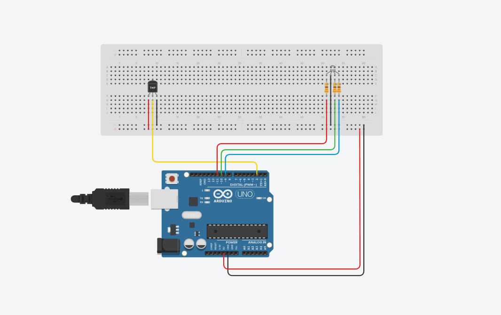

# Demo 02 – Dew-Point Greenhouse Indicator

This demo shows how the **myDHT beginner layer** can be used to build a **real, useful project** with almost no configuration.

Instead of just printing temperature and humidity, this project uses the **dew point** to estimate **condensation risk** inside a greenhouse, terrarium, or indoor growing space — and shows the result using a simple RGB LED.

No display.  
No complex logic.  
Just meaningful feedback.

---

## What This Project Demonstrates

- Zero-configuration DHT usage  
- Automatic DHT11 / DHT22 detection  
- Safe, enforced sensor read intervals  
- Reliable cached readings  
- Practical use of **dew point**  
- Visual, beginner-friendly feedback (RGB LED)

---

## Why Dew Point?

Temperature and humidity alone do **not** tell you when condensation will occur.

**Dew point** tells you how close the air is to saturation.  
When air temperature approaches the dew point, moisture begins to condense on cooler surfaces — plant leaves, greenhouse walls, soil.

This is critical for:
- preventing mold and rot  
- protecting plant health  
- knowing *when* to ventilate  

---

## How It Works

The project continuously calculates the difference between:

```
Air Temperature − Dew Point
```


This value tells us how close the environment is to condensation.

### RGB Status Logic

| LED Color | Condition | Meaning |
|---------|-----------|--------|
| 🟢 Green | T − DP ≥ 5 °C | Safe – low condensation risk |
| 🟡 Yellow | 3 °C ≤ T − DP < 5 °C | Warning – approaching saturation |
| 🔴 Red | T − DP < 3 °C | High risk of condensation |

The RGB LED updates automatically based on live sensor readings.

---

## Hardware Required

- Arduino Uno / Nano  
- DHT11 or DHT22 sensor  
- RGB LED (common cathode recommended)  
- 3× current-limiting resistors (220–330 Ω)  
- Breadboard and jumper wires  

---

## Wiring Diagram



### Notes
- DHT **DATA** pin is connected to **Arduino pin 2**
- RGB LED uses **PWM pins 9, 10, 11**
- Each LED color must have its own resistor
- Common cathode RGB LED connects to **GND**

> If you are using a **common anode RGB LED**, invert the PWM values in code.

---

## Visual Example


---

## Code

```cpp
#include <myDHT.h>

const int DHT_PIN = 2;
myDHT dht(DHT_PIN);

// RGB pins
const int PIN_R = 11;
const int PIN_G = 10;
const int PIN_B = 9;

void setRGB(uint8_t r, uint8_t g, uint8_t b)
{
  analogWrite(PIN_R, r);
  analogWrite(PIN_G, g);
  analogWrite(PIN_B, b);
}

void setup()
{
  Serial.begin(115200);
  dht.begin();

  pinMode(PIN_R, OUTPUT);
  pinMode(PIN_G, OUTPUT);
  pinMode(PIN_B, OUTPUT);

  setRGB(0, 0, 0);
}

void loop()
{
  float t  = dht.getTemperature(Celsius);
  float h  = dht.getHumidity();
  float dp = dht.dewPoint(Celsius);

  float spread = t - dp;

  if (spread < 3.0) {
    setRGB(255, 0, 0);       // Red
  } else if (spread < 5.0) {
    setRGB(255, 120, 0);     // Yellow
  } else {
    setRGB(0, 255, 0);       // Green
  }

  Serial.print("T: "); Serial.print(t); Serial.print(" C, ");
  Serial.print("RH: "); Serial.print(h); Serial.print(" %, ");
  Serial.print("DP: "); Serial.print(dp); Serial.print(" C, ");
  Serial.print("T-DP: "); Serial.print(spread); Serial.println(" C");
  Serial.println("-------------------------------------------------------------");

  delay(dht.getMinInterval());
}
```

---

## How to Use It

1. Upload the sketch  
2. Open Serial Monitor at **115200 baud**  
3. Observe the RGB LED  
4. Increase humidity (breathe near the sensor or mist plants)  
5. Watch the LED change from green → yellow → red  

---

## Real-World Use Cases

- Greenhouse monitoring  
- Indoor plant care  
- Terrariums  
- Mold prevention in rooms  
- Smart ventilation systems (future upgrade)

This demo can easily be extended to:
- control a fan or vent  
- trigger a misting system  
- log dew-point trends over time  

---

## Next Steps

- Add a relay to control ventilation  
- Add a buzzer for audible warnings  
- Combine with soil moisture sensors  
- Build a fully automated greenhouse controller  

---

## License

MIT License  
© myDHT Project

---