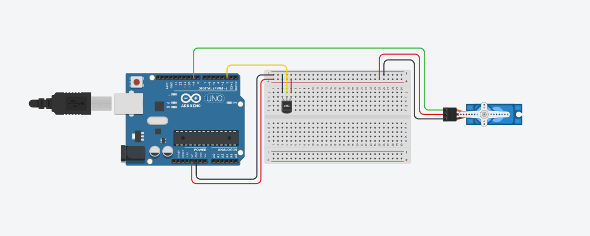

# Demo 03 – Heat Index Gauge

This demo uses the **myDHT beginner layer** to turn environmental data into
something you can **see and feel**.

Instead of reading numbers on a screen, the **Heat Index** (how hot it actually
feels) is shown on a **servo-driven analog gauge** with a moving needle.
As temperature and humidity change, the needle moves — just like a real
instrument.

Simple hardware.  
Clear feedback.  
A project that feels *alive*.

---

## What This Project Demonstrates

- Zero-configuration DHT usage  
- Automatic DHT11 / DHT22 detection  
- Safe, enforced sensor read intervals  
- Reliable cached readings  
- Practical use of **Heat Index**  
- Basic actuator control using a **servo motor**

---

## What Is Heat Index?

Heat Index is an *apparent temperature* value that combines:
- air temperature
- relative humidity

High humidity reduces the body’s ability to cool itself, making conditions feel
hotter than the measured temperature alone.

In short:

> **Heat Index describes how hot it feels to a person.**

---

## How It Works

The sketch reads Heat Index in Celsius:

```cpp
float hi = dht.HiIndex(Celsius);
```

That value is mapped linearly to the full servo range:

- **20 °C Heat Index → 0°**
- **55 °C Heat Index → 180°**

The servo moves directly to the calculated position, behaving like a simple
analog gauge that reacts to real environmental changes.

---

## Hardware Required

- Arduino Uno / Nano  
- DHT11 or DHT22 sensor  
- Micro servo motor (SG90 / MG90S)  
- Breadboard  
- Jumper wires  
- USB cable (power)

---

## Wiring Diagram



### Notes

- DHT **DATA** → Arduino **pin 2**  
- Servo **Signal** → Arduino **pin 9**  
- Servo **VCC** → **5V**  
- Servo **GND** → **GND**  
- For bare (4-pin) DHT sensors, use a **10kΩ pull-up resistor**
  between **VCC** and **DATA**

---

## Building the Gauge

The gauge itself is intentionally low-tech.

With **paper or cardboard**, **scissors**, **glue**, **markers**, and a bit of
creativity, you can build a clear and effective analog scale in just a few
minutes.

The servo horn becomes the needle, and the gauge background gives context to the
movement. Precision is not the goal — **visual clarity is**.

---

## Visual Example

The Heat Index Gauge in action.


---

## Short Demo Video

The video below shows the gauge reacting in real time as temperature and
humidity change.

▶️ **Demo video:** `media/HeatIndexGauge_demo.mov`

---

## Code

Open `HeatIndexGauge.ino` and upload it to your Arduino.

On startup, the needle centers briefly, confirming that the servo is wired and
working correctly.

---

## How to Use It

1. Upload the sketch  
2. Open the Serial Monitor at **115200 baud**  
3. Observe the gauge needle  
4. Change temperature and/or humidity near the sensor  
5. Watch the gauge respond to Heat Index changes  

---

## Real-World Use Cases

- Indoor comfort indication  
- Heat stress awareness  
- Educational weather instruments  
- Visual feedback for environmental data  

---

## License

MIT License  
© myDHT Project

---